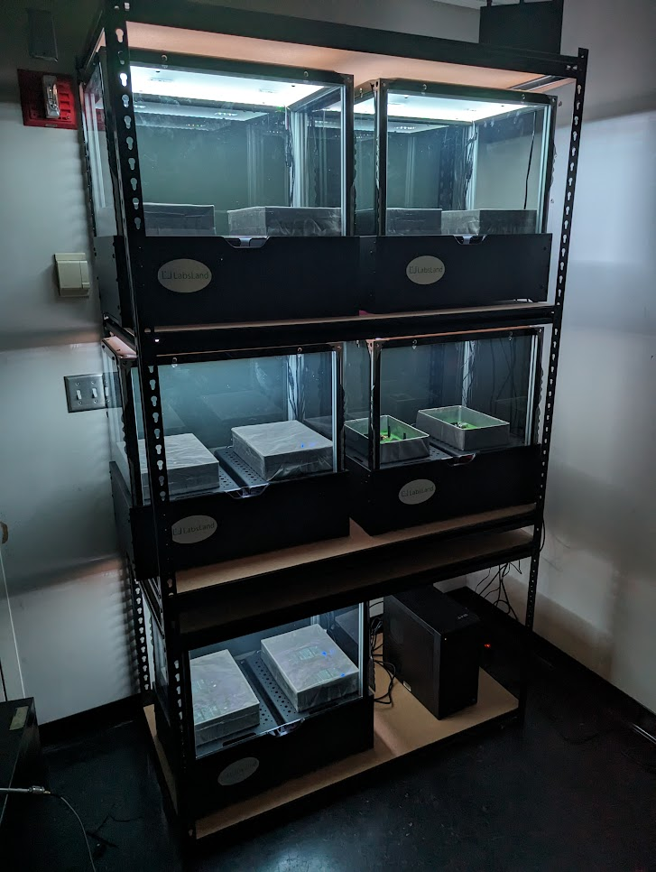
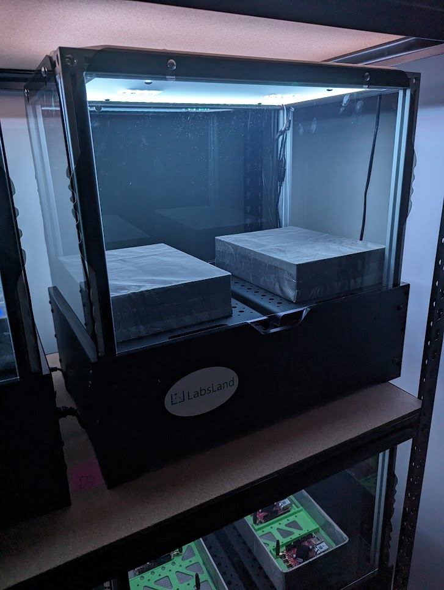

# RHL RELIA Hardware Installation Docs

## Introduction

In the RHL RELIA project, we create remote laboratories for SDR (Software-Defined Radio), relying on the open-source [GNU Radio](https://www.gnuradio.org/). Most of the software and hardware developed in this project would work with any SDR kit that is supported by GNU Radio. Within the project, we have used two kits:

 * [ADALM Pluto](https://www.analog.com/en/resources/evaluation-hardware-and-software/evaluation-boards-kits/adalm-pluto.html)
 * [Red Pitaya STEMlab 125-14](https://redpitaya.com/stemlab-125-14/)

This document explains how to install the equipment and integrate it with RHL Relia. If you are interested in using RHL Relia with a different kit, please contact us.

## 3D-printed pieces

@zzyzzy42 how to print and why and which pieces

### Option 1: ADALM Pluto

@zzyzzy42 how to print, how to install, what model, and why and which pieces

### Option 2: Red Pitaya

@zzyzzy42 how to print, how to install, what model, and why and which pieces

## Structures

There are two alternatives. We have done both during the RHL RELIA project:
 * Creating our own structure
 * Relying on a third party-structure (such as LabsLand Prism4)

In this section, we explain both approaches.

### Option 1: Build your structure

What you have to have is essential:

 * A Raspberry Pi 4, fully powered with a proper USB charger (or any other charger, e.g., GPIO)
 * The two SDR devices (e.g., two ADALM Pluto or two Red Pitaya)
 * A camera (this is optional, but it helps students see that they are working with a real device and not with a simulation), and a camera management system (such as [WILSP](https://github.com/zstars/wilsp) -[paper](https://ieeexplore.ieee.org/document/7937791)-, [motion](https://motion-project.github.io/) or any other).

Then you need some space where to put it, such as some kind of shelves, etc., and you need to use a power strip and an ethernet switch to use it.

In the picture above, you can see one shelving unit, with two setups of ADALM Pluto (and their corresponding Raspberry Pi), without the Faraday boxes, and two Red Pitaya on the bottom right (not yet connected).

### Option 2: LabsLand Prism4

Alternatively, [LabsLand](https://labsland.com) provides the Prism4 structures, which are more compact and they already provide mechanisms for powering up two setups with a single power supply.

