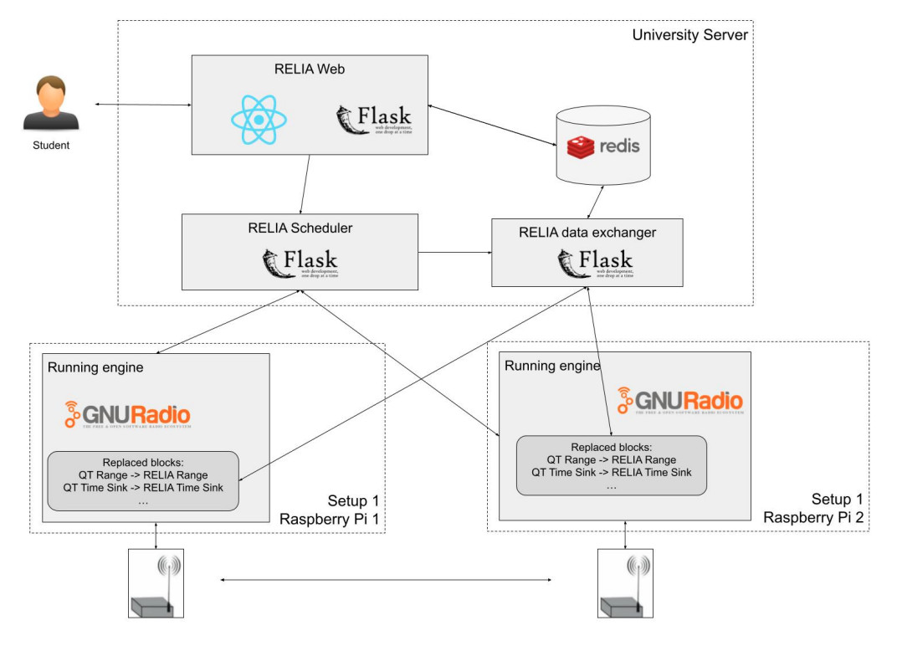

# RHL RELIA Technical Documentation

## Introduction

RELIA is designed so that students can use the remote laboratory in an efficient and scalable way. To do so, students will only interact with the University Server in the following diagram, particularly with the web and the scheduler. There will be multiple setups (and each setup will have two SDR devices), so a student will have for some seconds access to that setup. So as to support multiple students, we support multiple setups that connect to the global scheduler, and will exchange data to the user through the RELIA data uploader:



Figure from: ```Inonan, M., Chap, B., Orduña, P., Hussein, R., & Arabshahi, P. (2023, March). RHLab scalable software defined radio (SDR) remote laboratory. In International Conference on Remote Engineering and Virtual Instrumentation (pp. 237-248). Cham: Springer Nature Switzerland.```

## Server installation

### Installation of the components

#### Downloading the source code

Make a git clone of all the repositories

#### Installing other services

@porduna

Install supervisor
Install Apache
Install Redis Server

#### RHL Frontend


1. Install node and npm from here: https://nodejs.org/en/download/. Once this is completed, make sure to also run `npm i jquery --save` to ensure all $ characters are understood in the repository.
2. run `npm install`

With this you can run the following:
* `npm start`: This command starts the development server.
* `npm start:pluto:prod`: Starts the production server with Pluto environment variables.
* `npm start:pluto:staging`: Starts the staging server with Pluto environment variables.
* `npm start:redpitaya:prod`: Starts the production server with Redpitaya environment variables.
* `npm start:redpitaya:staging`: Starts the staging server with Redpitaya environment variables.
* `npm build:pluto:prod`: Builds the production bundle with Pluto environment variables.
* `npm build:pluto:staging`: Builds the staging bundle with Pluto environment variables.
* `npm build:redpitaya:prod`: Builds the production bundle with Redpitaya environment variables.
* `npm build:redpitaya:staging`: Builds the staging bundle with Redpitaya environment variables.
* `npm build`: Builds the production bundle.
* `npm test`: Runs tests.
* `npm i18n:scan`: Scans for internationalization keys using i18next-scanner.

#### RHL Backend

#### Configuring prodrc
#### Instaling requirements
Make sure you have both python 3 and flask installed
Linux (Ubuntu):
* Install Python 3:
1. `sudo apt install python3`
* Install Flask:
1. `sudo apt install python3-pip`
2. `pip3 install flask`
#### Creating a python virtualenv
1. run `python3 -mvenv env`
2. Activate the environment: `.env/bin/activate $ pip install -r requirements.txt`
#### Running the backend
1. `. devrc`
2. `.env/bin/activate`
3. `flask run --with-threads --exclude-patterns "/uploads`
@pedrodeoliamarante explain how to install the blocks

##### Installing GNU-RADIO
* Linux: Run `sudo apt-get install gnuradio` on your terminal
* Mac: Run `brew install gnuradio` on your terminal
* Windowns: Download and run https://github.com/ryanvolz/radioconda/releases/download/2024.01.26/radioconda-2024.01.26-Windows-x86_64.exe
* For more information: https://wiki.gnuradio.org/index.php/InstallingGR

#### Instaling blocks

### RHL Scheduler 

#### Configuring prodrc
#### Instaling requirements
Make sure you have both python 3 and flask installed
Linux (Ubuntu):
* Install Python 3:
1. `sudo apt install python3`
* Install Flask:
1. `sudo apt install python3-pip`
2. `pip3 install flask`
#### Creating a python virtualenv
1. run `python3 -mvenv env`
2. Activate the environment: `.env/bin/activate $ pip install -r requirements.txt`
#### Running the backend
1. `. devrc`
2. `.env/bin/activate`
3. `flask run --with-threads

### RHL Data Uploader

#### Configuring prodrc
#### Instaling requirements
Make sure you have both python 3 and flask installed
Linux (Ubuntu):
* Install Python 3:
1. `sudo apt install python3`
* Install Flask:
1. `sudo apt install python3-pip`
2. `pip3 install flask`
#### Creating a python virtualenv
1. run `python3 -mvenv env`
2. Activate the environment: `.env/bin/activate $ pip install -r requirements.txt`
#### Running the backend
1. `. devrc`
2. `.env/bin/activate`
3. `flask run --with-threads

#### Configuring supervisor

@porduna (here we use sample supervisor file)

#### Configuring Apache2

@porduna (here we use a smaple apache configuration file)

## Raspberry Pi installation

### Common components

1. Clone the RasberryPi Repos
#### relia-gr-runner
#### Instaling requirements
* Install Python 3:
1. `sudo apt install python3`
* Install Flask:
1. `sudo apt install python3-pip`
2. `pip3 install flask`

When you want to run the transmitter do:
1.  devrc-transmitter
2.  flask process-tasks

When you want to run the receiver do:
1.  devrc-receiver
2.  flask process-tasks
#### Instaling GNU-Radio
* Run  `sudo apt-get install gnuradio`
@pedrodeoliamarante configuring the prodrc files and supervisor

### ADALM Pluto specifics

TO BE DEFINED

### Red Pitaya specifics

Software Installation On Laptop/Computer/Raspberry Pi
mkdir ~/code 
cd ~/code 
git clone https://github.com/pavel-demin/red-pitaya-notes
Then create an executable file ~/rpgr with these contents (3 lines):

#!/bin/bash 
export GRC_BLOCKS_PATH=$HOME/code/red-pitaya-notes/projects/sdr_transceiver/gnuradio 
gnuradio-companion

Then startup GNU Radio (with the modules of Red Pitaya installed) type this laptop:
~/rpgr

## Student management

@porduna talk about WebLab-Deusto, LabDiscoveryEngine, and LabsLand.

