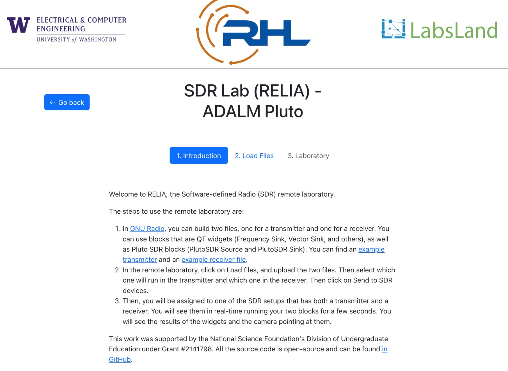
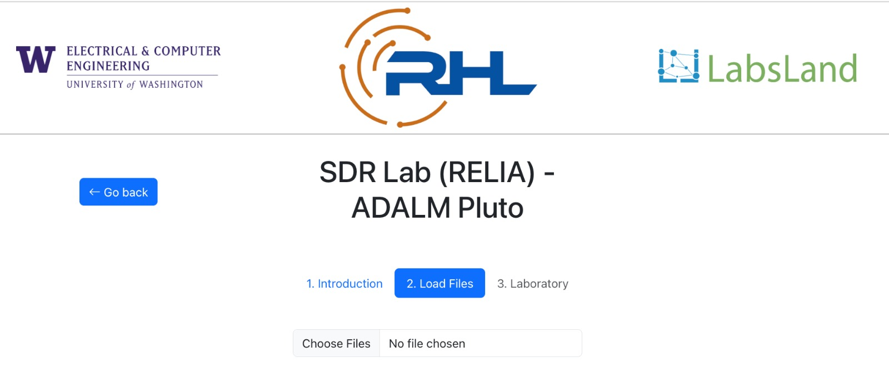
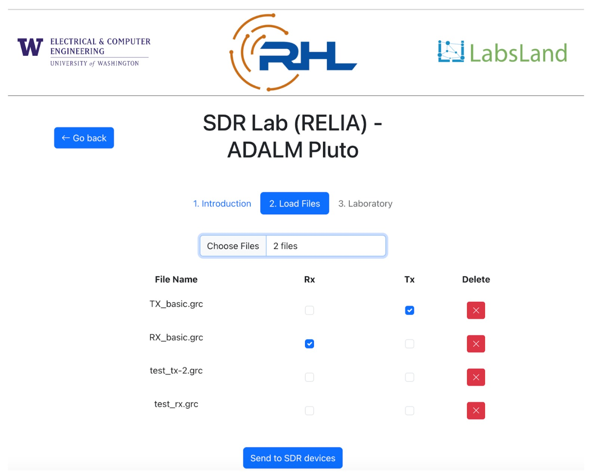

# RHL RELIA User documentation

## Introduction

RHL RELIA is a distributed remote laboratory designed for wireless experiments, composed of multiple transmitter-receiver instances, each utilizing an ADALM-Pluto SDR. Users can design their experiments locally using GNU Radio Companion and then access RHL RELIA to upload the corresponding .grc configuration files to any available instance.

To access RHL RELIA, users must first register. Please create an account by visiting [RELIA registration](https://uw.labsland.com/standalone/join/AQTX5676) and choose: **It is my first time in LabsLand.**

1. Access [RHL RELIA](https://uw.labsland.com/standalone/login?url=%2Fstandalone%2F%3F) and enter the following icon: 

2. You will see the a brief introduction about how RELIA works as is shown in the figure below that explains how RHL RELIA works

<!--  -->

<!-- #@marcosinonan : screenshot and what they will expect -->

## Uploading files

<!-- @marcosinonan : screenshot and how it works -->

To upload your .grc files the user must click on the tab 2. Users can upload as many files as needed by clicking on "Chosen Files." However, it's important to note that for the specific tasks of transmission and reception, users are required to select one file each to be sent to ADALM-PLUTO. In the figure below, although there are four uploaded files, only "TX_basic.grc" is sent to the ADALM-PLUTO Transmitter, and "RX_basic.grc" is sent to the ADALM-PLUTO Receiver.

## Using the laboratory widgets

@marcosinonan :  screenshot showing what is each part (e.g., camera, transmitter, receiver), and that it is in a faraday cage (so they know that the image is awkward but that's fine and good)

## Supported GNU Radio widgets

@marcosinonan what widgets are supported, make a subsection for each of them.

### Vector Sink

@marcosinonan (this is an example, put a figure of how it looks in GNU Radio and how it looks in RELIA, and if there is any limitation)

@marcosinonan (the same with the rest of the widgets)

