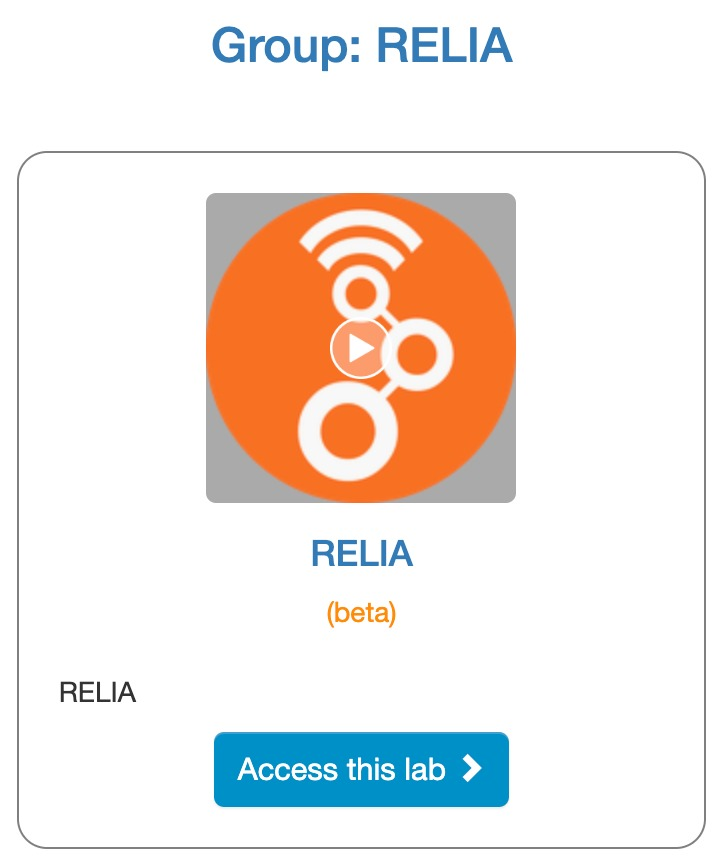

# RHL RELIA User documentation

## Introduction

RHL RELIA is an educational remote laboratory to perform wireless experiments controlling ADALM-Pluto SDR for dedicated both transmitter and receiver. The user can configure an experiment for both trasnmitter and receiver utilizing GNU Radio Companion at their local computer and then access RHL RELIA to upload the configuration 'grc' files. 

If you haven't registered yet, please create an account by visiting the following link [RELIA registration](https://uw.labsland.com/standalone/join/AQTX5676) and choose: It is my first time in LabsLand.

<!-- #@marcosinonan : screenshot and what they will expect -->

## Uploading files

@marcosinonan : screenshot and how it works

## Using the laboratory widgets

@marcosinonan :  screenshot showing what is each part (e.g., camera, transmitter, receiver), and that it is in a faraday cage (so they know that the image is awkward but that's fine and good)

## Supported GNU Radio widgets

@marcosinonan what widgets are supported, make a subsection for each of them.

### Vector Sink

@marcosinonan (this is an example, put a figure of how it looks in GNU Radio and how it looks in RELIA, and if there is any limitation)

@marcosinonan (the same with the rest of the widgets)

