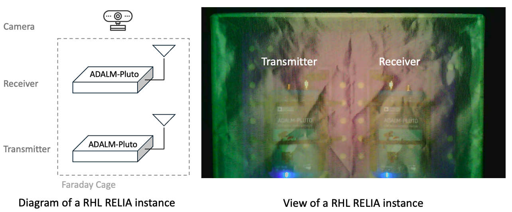
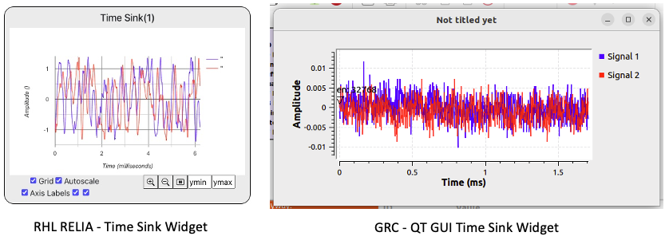
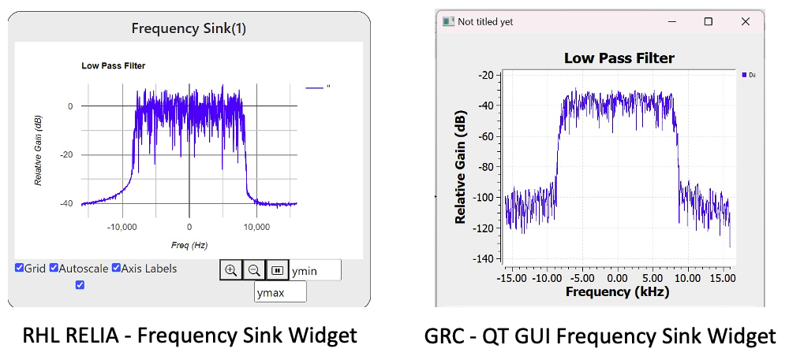
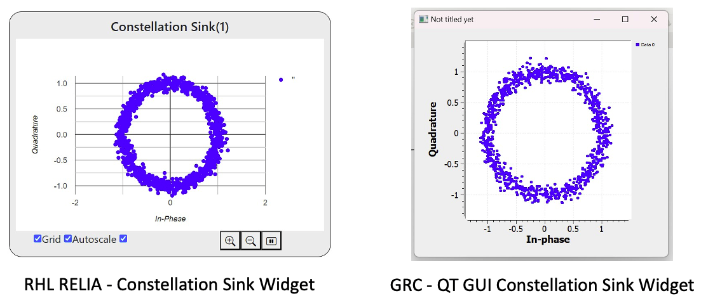
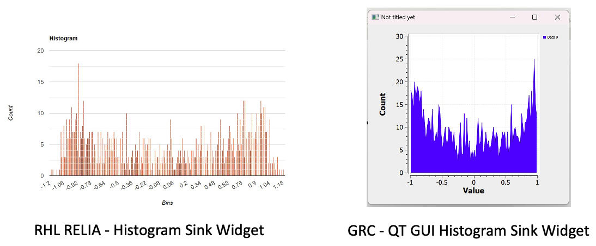

# RHL RELIA User documentation

## Introduction
 
RHL RELIA is a distributed remote laboratory designed for wireless experiments, composed of multiple transmitter-receiver instances, each utilizing an ADALM-Pluto SDR. Users can design their experiments locally using GNU Radio Companion and then access RHL RELIA to upload the corresponding .grc configuration files to any available instance.

1. Access [RHL RELIA](https://uw.labsland.com/standalone/login?url=%2Fstandalone%2F%3F) and enter the following icon: 

    

2. Netx, a brief introduction about how RELIA works is shown as the figure below. After reading click on tab "2. Load Files"
    

<!--  -->

<!-- #@marcosinonan : screenshot and what they will expect -->

## Uploading files

<!-- @marcosinonan : screenshot and how it works -->

An user can upload as many ".grc" files as needed by clicking on "Chosen Files." However, only one file can be sent to the Transmitter and another to the Receiver instance, depending on the selected function. As shown in the figure below, despite four files being uploaded, only "TX_basic.grc" is sent to the ADALM-PLUTO Transmitter, and "RX_basic.grc" is sent to the ADALM-PLUTO Receiver.

## Using the laboratory widgets

Each RHL RELIA instance is composed of an ADALM-Pluto SDR transmitter and receiver, isolated with electro-textile metallization material to create a Faraday cage, as shown in the figure below (left). When users operate RHL RELIA, they can view the corresponding hardware depicted in the figure below (right).

<!-- @marcosinonan :  screenshot showing what is each part (e.g., camera, transmitter, receiver), and that it is in a faraday cage (so they know that the image is awkward but that's fine and good)
 -->

## Supported GNU Radio widgets

<!-- @marcosinonan what widgets are supported, make a subsection for each of them.-->
RHL RELIA offers a variety of widgets and variables that are compatible with GNU Radio Companion (GRC). This allows users to design experiments locally in GRC and execute them remotely, ensuring seamless integration and ease of use.

### Time Sink 

This sink allows for the display of multiple signals in time domain. The RHL RELIA time sink can present both real (float) and I/Q (complex) signals across one to five channels simultaneously. Additionally, it includes checkboxes to enable various graphical options such as Grid ON/OFF, Axis Labels ON/OFF, AutoScale, Zoom IN/OUT, Pause, and the ability to set y-limits for signal amplitude. Below is a comparison between the RHL RELIA Time Sink (left) and the GRC QT Time Sink (right).

### Frequency Sink 

This sink allows for the display of multiple signals in frequecny domain. The RHL RELIA frequency sink plots Power Spectral Density (PSD) of signals assigning a power value to every frequency bin to unti five channels simultaneously. Additionally, it includes checkboxes to enable various graphical options such as Grid ON/OFF, Axis Labels ON/OFF, AutoScale, Zoom IN/OUT, Pause, and the ability to set y-limits for signal amplitude. Below is a comparison between the RHL RELIA Freqeucny Sink (left) and the GRC QT Freqeucny Sink (right).

### Vector Sink

This sink enables the display of multiple data vectors and allows for plotting sequences in any domain with the RHL RELIA Vector sink. It can be used to analyze various types of signals and even create custom domains. The interface includes checkboxes to toggle graphical options like Grid ON/OFF, Axis Labels ON/OFF, AutoScale, Zoom IN/OUT, Pause, and the ability to set y-limits for signal amplitude. Below is a comparison of a triangular signal between the RHL RELIA Vector Sink (left) and the GRC QT Vector Sink (right).

### Constellation Sink

This sink allows the display of IQ signals in the constellation domain, accepting complex signals as input. The interface includes checkboxes to toggle graphical options such as Grid ON/OFF, AutoScale, Zoom IN/OUT, and Pause. Below is a comparison of a complex IQ sine wave between the RHL RELIA Constellation Sink (left) and the GRC QT Constellation Sink (right).

### Histogram Sink

This sink displays a histogram of real data. The user can set the bit range and adjust the number of bins for the histogram to control the granularity of the data distribution. The interface includes checkboxes to toggle graphical options such as Grid ON/OFF, AutoScale, Zoom IN/OUT, and Pause. Below is a comparison of a complex IQ sine wave between the RHL RELIA Histogram Sink (left) and the GRC QT Histogram Sink (right).

<!--@marcosinonan (this is an example, put a figure of how it looks in GNU Radio and how it looks in RELIA, and if there is any limitation)

@marcosinonan (the same with the rest of the widgets) -->

